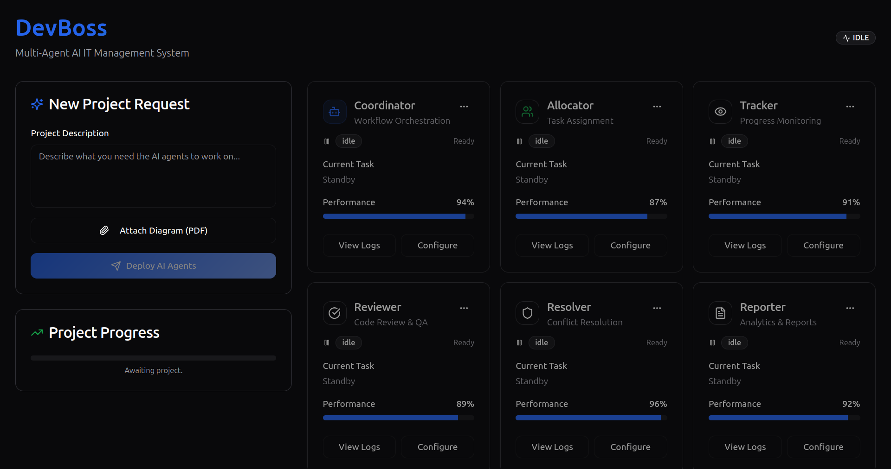
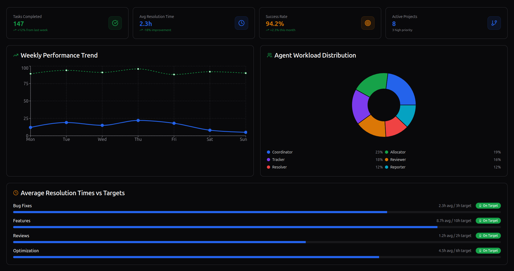

# DevBoss 


 


DevBoss is an autonomous, multi-agent AI system designed to act as an AI IT Manager. It intelligently handles the entire project lifecycle—from planning and Jira ticket creation to progress tracking and human-in-the-loop escalation—allowing your development team to focus on what they do best: building.

## The Problem It Solves

In modern IT, valuable senior developers and project managers spend up to 40% of their time on routine administrative tasks instead of innovation. This includes creating tickets, tracking progress, resolving minor blockers, and compiling reports. DevBoss Swarm automates these tasks to reclaim that lost time and boost project velocity.

## Key Features

- **Autonomous Planning:** Takes a high-level goal and creates a detailed project plan.  
- **Live Jira Integration:** Automatically creates and monitors tickets in your Jira project.  
- **Human-in-the-Loop:** Pauses and asks for human input on ambiguous or critical decisions.  
- **Self-Optimization:** A Reinforcement Learning module helps the system get smarter with every project.  
- **Full-Stack Application:** Includes a FastAPI backend and a professional React UI for interaction.  

---

## ⚙️ Setup and Installation

### 1. Backend Setup (Python)

First, set up the server that runs the AI agents.

```bash
# Clone the repository
git clone https://github.com/rohitkshirsagar19/DevBoss.git
cd DevBoss

# Create and activate a Python virtual environment
python -m venv venv
source venv/bin/activate  # On Windows: .\venv\Scripts\activate

# Install Python dependencies
pip install -r requirements.txt
```
### Environment Variables:

Create a file named .env in the root of the project and add your credentials:
#### .env file
```
# Your OpenAI API Key
OPENAI_API_KEY="sk-..."

# Your Jira Credentials
JIRA_DOMAIN="your-domain.atlassian.net"
EMAIL="your-jira-email@example.com"
JIRA_API_TOKEN="your-jira-api-token-here"
```
(Example .env is available in the repo)

### 2. Frontend Setup (React)

The UI is a modern React application built with Vite.

```
# Navigate to your frontend directory (if it's separate)
# cd frontend

# Install Node.js dependencies
npm install
```

### 4. Running the Application

You need to run both the backend and frontend servers simultaneously in two separate terminals.

Terminal 1: Start the Backend
```
# From the project root, with your venv active
fastapi dev main.py
```
The backend will be running at http://localhost:8000.
( You can check the APIs in the swagger UI)

Terminal 2: Start the Frontend
```
# From the frontend directory
npm run dev
```
The frontend UI will be available at http://localhost:8080. Open this URL in your browser to use the application.
